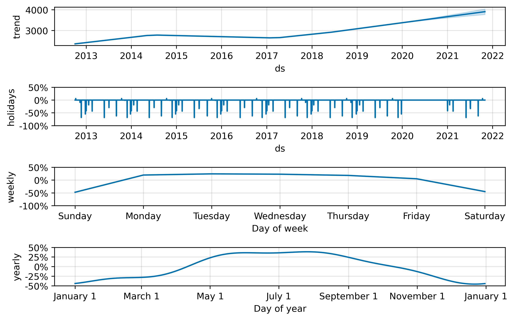

# `Seattle Fremont bridge bicycle daily count forecast using facebook's prophet library [project]`

### `Project Aim`: The aim is to forecast the Fremont Bridge Bicycle ridership for next two years using facebook's prophet library.

### `Requirements`: python 3.9, numpy, matplotlib, plotly, prophet and json

### `OS`: Tested on windows and Linux

### `Dataset Description`
The Fremont Bridge Bicycle Count dataset includes bycycle count from October 2012 to 2019. It consist of count records (number of bikes that cross the bridge using the pedestrian/bicycle pathways). 
Inductive loops on the east and west pathways count the passing of bicycles regardless of travel direction.

### `Notebook Information`

* This notebook consist of forecasting codes
* Forecasting is done using Meta's prophet library. 
* Here I have forecasted the Bicycle counts for next 2 years.
* Included holidays (Washinton) to observe the impact on daily counts.
* Performed a forward-chaining cross-validation.

### `Project outline step by step:`

1. Importing important libraries
2. Reading and loading data from kaggle: [Data Source](https://www.kaggle.com/datasets/city-of-seattle/seattle-fremont-bridge-hourly-bicycle-counts)
3. EDA: Performing exploratory analysis
4. Converted (resamples) data to daily and weekly count to check the pattern and inconsistencies

Here is a plot for weekly ridership count

5. Next, added holidays to check the impact of holidays on count forecast
    * Holidays associated with Washinton states has been utilised
6. Trained the model using prophet library
    * Set the seassionality mode to `multiplicative`
    * Set a yearly seassionality to 4
    * Added the holidays 
7. Generated the forecast plot using matplotlib and plotly (interactive plot)

8. Saved the model to json file using pickle library
9. Generated a components plot using matplotlib and plotly (interactive plot)
    * The component plot is showing that the bicycle ridership `tread is upward` since 2017 and still increasing.
    * The `yearly trend` shows that `June to August` (summer) the bicycle `ridership grows by 40%`, while it `drops` by `20%-40%` during `January to March` (winder season).
    * `Weekly ridership` trend revealed that `Monday to Friday` the ridership `increases by 20%` while during `weekend` it `drops` by `40%`.

10. Performed model evaluation using a forward chaining cross-validation with
    * horizon = '90 days'
    * period = '30 days',
    * initial = '730 days'
    * parallel = 'processes' (enabled parellel processing)
11. Generated a cross-validation metric plot
    * Used `rmse` as evaluation metric and selected a `rolling_window` of 0.1 (10%)

